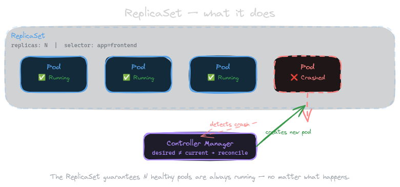
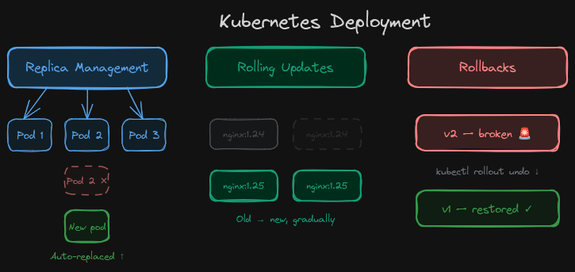
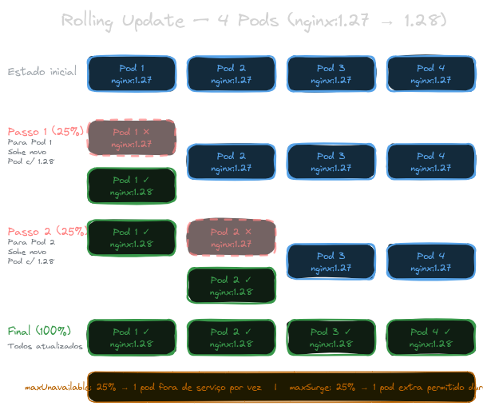
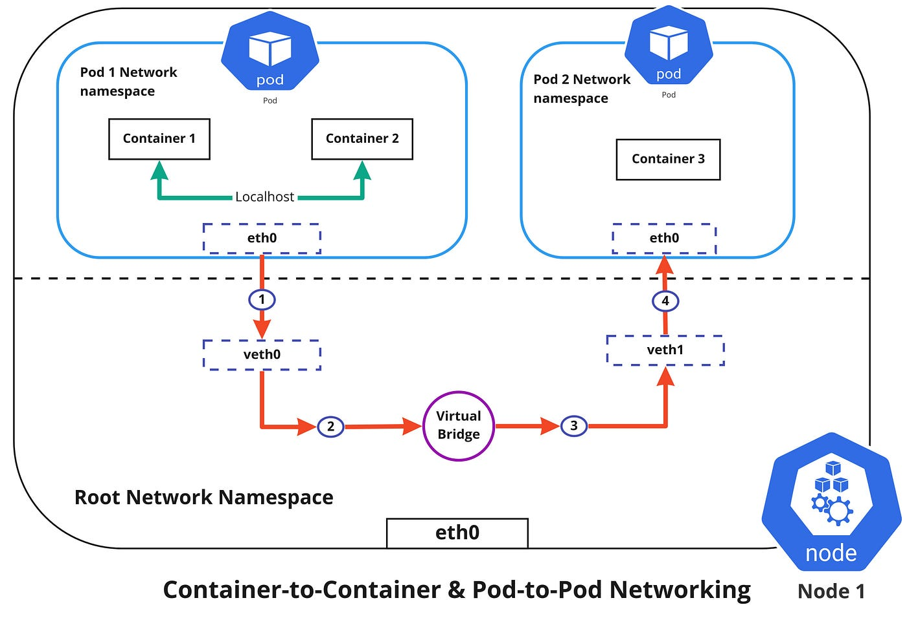
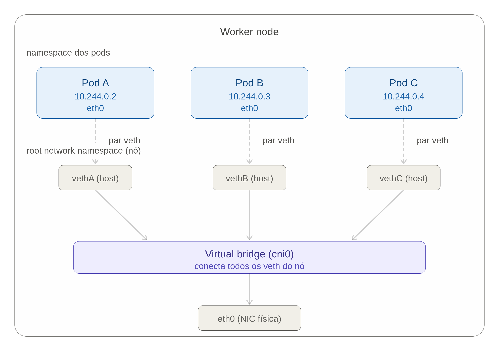
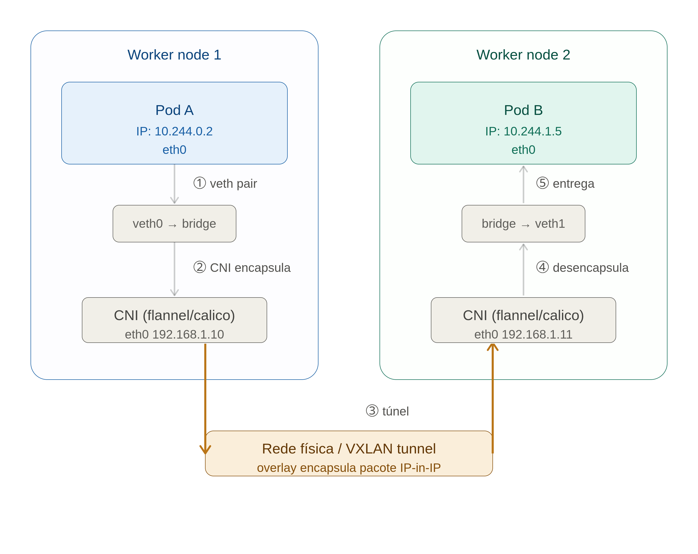

# Kubernets course
This is a readme for documentation of my studies on kubernets, that i am start today using the course on udemy


# What is Kubernets ?

KUbernets is an open-source system for container orchestration  it manages all life cycle of containers docker.


this is an Kubernets cluster example:

### Control plane

The control plane is very important for manage the custer, is the brain of the cluster inside it we have some very importants parts of kubernets like:

- `ETCD`: The database no sql that kubernets use for save the worker's node state 

- `Scheduler`: Scheduler is who decide where a new pod should run based on the node helth metrics

- `Controler Manager`: This men is who control the cluster based in wath you want, example... if you want an container have 3 replicas, the control manage will mantain tre container's replica. Another important thing is an controller of the nodes, so he monitor if the nodes is sending health checks to him. 

## Data Plane

Imagine the diference between the control plan and Data plane is like the control is the brain and the data plane is the arms of the applications. Here we have the worker's node, can be physcal machine, or Virtual machines or containers like we are using now with the minukube. Inside the workers we have some componets importants like:

- `Pod`: Pod is the more litle part of the kubernets cluster, we have a pod, an inside the pod we can have some containers docker running inside it 
- `Kubelet`: The kubelet is who care about the containers is running helth or not, for example, if an container inside the pod down the kubelet restart the container, is a just simple example bu he has another responsibilites, talk with the cluster API server, sending helth metrics.
- `Kubeproxy`: The kubeproxy inside the node is the Network manager, DNS, IP, Proxy.....

One thing important, the kubelet dosen't run the container directaly inside the node, for it we have anothers tools calleb by `CRI (Container running interface)` so all kubernts cluster doesn't run the docker contarners diretaly, for it he use another tool for run docker containers like

- Container-d
- cri-o 

## Minikube
  Responsible for up un cluster kubernets on our local machine inside docker container

For install minikube

```bash
curl -LO https://storage.googleapis.com/minikube/releases/latest/minikube-linux-amd64
sudo install minikube-linux-amd64 /usr/local/bin/minikube
minikube version
```

After install the minikube, just start it with

```bash
minikube start
```

You will see the display on your terminal

```bash
  Kubernets-Course git:(main) minikube start

😄  minikube v1.38.1 on Ubuntu 26.04
✨  Automatically selected the docker driver. Other choices: ssh, none
❗  Starting v1.39.0, minikube will default to "containerd" container runtime. See #21973 for more info.
📌  Using Docker driver with root privileges
👍  Starting "minikube" primary control-plane node in "minikube" cluster
🚜  Pulling base image v0.0.50 ...
💾  Downloading Kubernetes v1.35.1 preload ...
    > preloaded-images-k8s-v18-v1...:  272.45 MiB / 272.45 MiB  100.00% 28.97 M
    > gcr.io/k8s-minikube/kicbase...:  519.58 MiB / 519.58 MiB  100.00% 29.19 M
🔥  Creating docker container (CPUs=2, Memory=7800MB) ...
🐳  Preparing Kubernetes v1.35.1 on Docker 29.2.1 ...
🔗  Configuring bridge CNI (Container Networking Interface) ...
🔎  Verifying Kubernetes components...
    ▪ Using image gcr.io/k8s-minikube/storage-provisioner:v5
🌟  Enabled addons: storage-provisioner, default-storageclass
💡  kubectl not found. If you need it, try: 'minikube kubectl -- get pods -A'
🏄  Done! kubectl is now configured to use "minikube" cluster and "default" namespace by default

``` 
You can see the the minkube container up in your machine with

```bash
➜  ~ docker ps
CONTAINER ID   IMAGE                                 COMMAND                  CREATED         STATUS         PORTS                                                                                                                                  NAMES
2f80f64219c3   gcr.io/k8s-minikube/kicbase:v0.0.50   "/usr/local/bin/entr…"   3 minutes ago   Up 3 minutes   127.0.0.1:32773->22/tcp, 127.0.0.1:32774->2376/tcp, 127.0.0.1:32775->5000/tcp, 127.0.0.1:32776->8443/tcp, 127.0.0.1:32777->32443/tcp   minikube
➜  ~ 

```

if you want stop your cluster only run the comand

```bash 
minikube stop
```

or if you want delete the cluster

```bash
minikube delete
```

## Kubectl

Kubectl is the official cli from kubernets, with it we will interact with the kubernets cluster.

For install kubectl

```bash 
cd /tmp
KUBECTL_VERSION=$(curl -sL https://dl.k8s.io/release/stable.txt)

curl -LO "https://dl.k8s.io/release/${KUBECTL_VERSION}/bin/linux/amd64/kubectl"
curl -LO "https://dl.k8s.io/release/${KUBECTL_VERSION}/bin/linux/amd64/kubectl.sha256"

echo "$(cat kubectl.sha256)  kubectl" | sha256sum --check

sudo install -o root -g root -m 0755 kubectl /usr/local/bin/kubectl
kubectl version --client
``` 

After install we can use the comand for see all services runing on our cluster kubernets

```bash
ktop  Documents  Downloads  Music  Pictures  Public  Templates  Videos  snap
➜  ~ kubectl get po -A     
NAMESPACE     NAME                               READY   STATUS    RESTARTS      AGE
kube-system   coredns-7d764666f9-thj8t           1/1     Running   0             28m
kube-system   etcd-minikube                      1/1     Running   0             29m
kube-system   kube-apiserver-minikube            1/1     Running   0             28m
kube-system   kube-controller-manager-minikube   1/1     Running   0             28m
kube-system   kube-proxy-lfnhc                   1/1     Running   0             28m
kube-system   kube-scheduler-minikube            1/1     Running   0             28m
kube-system   storage-provisioner                1/1     Running   1 (28m ago)   28m
➜  ~ 

```


### Going UP the first pod

In just a simple comand we can up for example a nginx server:

```bash
kubectl run my-pod-apache-server --image httpd
```
output: 

```
pod/my-pod-apache-server created

```

For you see the pod created:

```bash
kubectl get pods  
```
Output:

```bash
➜  Kubernets-Course git:(main) ✗ kubectl get pods   
NAME                   READY   STATUS    RESTARTS   AGE
my-pod-apache-server   1/1     Running   0          4m9s
➜  Kubernets-Course git:(main) ✗ 

```
For see more informations about the pod:

```bash
➜  Kubernets-Course git:(main) ✗ kubectl get pods -o wide
NAME                   READY   STATUS    RESTARTS   AGE     IP           NODE       NOMINATED NODE   READINESS GATES
my-pod-apache-server   1/1     Running   0          4m48s   10.244.0.6   minikube   <none>           <none>
➜  Kubernets-Course git:(main) ✗ 

```

For you see the pods in real time you can use 

```bash
kubectl get pods -w     

NAME                   READY   STATUS    RESTARTS   AGE
my-pod-apache-server   1/1     Running   0          5m47s


```


if you use the comand for see all pods runing in the cluster tha we see before like:

```bash
➜  Kubernets-Course git:(main) ✗ kubectl get pods -A
NAMESPACE              NAME                                         READY   STATUS    RESTARTS      AGE
default                my-pod-apache-server                         1/1     Running   0             7m23s
kube-system            coredns-7d764666f9-hthb5                     1/1     Running   0             26h
kube-system            etcd-minikube                                1/1     Running   0             26h
kube-system            kube-apiserver-minikube                      1/1     Running   0             26h
kube-system            kube-controller-manager-minikube             1/1     Running   0             26h
kube-system            kube-proxy-hwb92                             1/1     Running   0             26h
kube-system            kube-scheduler-minikube                      1/1     Running   0             26h
kube-system            storage-provisioner                          1/1     Running   1 (26h ago)   26h
kubernetes-dashboard   dashboard-metrics-scraper-5565989548-gnqvs   1/1     Running   0             26h
kubernetes-dashboard   kubernetes-dashboard-b84665fb8-rcnnp         1/1     Running   0             26h
➜  Kubernets-Course git:(main) ✗ 

```

You will see your container in the namespace `default`.

For delete the pod you can use:

``` bash
➜  Kubernets-Course git:(main) ✗ kubectl delete pods my-pod-apache-server
pod "my-pod-apache-server" deleted from default namespace
➜  Kubernets-Course git:(main) ✗ 

```

now if you get the pods, there isn't the pod in your default namespace

```bash
➜  Kubernets-Course git:(main) ✗ kubectl get pods                        
No resources found in default namespace.
➜  Kubernets-Course git:(main) ✗ 

```

This is an form for you create a simple pod with just an comand, but in the day by day in the companys usualy we use the yaml files, for set the configurations of the pods, is a simple yaml that usualy the peoples uses in docker compose files we also will use with the pods configurations and another things in kubernets.


For example, we hava the file my-pod.yml in this repository:

```yml
apiVersion: v1
kind: Pod
metadata:
   name: my-pod-webserver
   labels: 
     apps: my-app
     tier: frontend
spec:
   containers:
   - name: my-container-nginx
     image: nginx

```


We are going up an container with a simple nginx app, for up the fod from yml file you can use the comand:

```bash
kubectl create -f my-pod.yml

```

output: 

```bash
pod/my-pod-webserver created

```

Now you can see the pod simple pod already created:

```bash
➜  Kubernets-Course git:(main) ✗ kubectl get pods            
NAME               READY   STATUS    RESTARTS   AGE
my-pod-webserver   1/1     Running   0          2m53s

```


## ReplicaSet




The replica set is an resource from kubernets that we can replicate the pod in anothers pods, for example in our aplication tha we were going up the nginx, with the replica set we can replicate the nginx in another for pods:


```yaml
apiVersion: apps/v1
kind: ReplicaSet
metadata: 
   name: frontend-rs
   labels: 
     app: frontend

spec: 
  template:
    metadata: 
      name: my-pod-webserver
      labels: 
        apps: my-app
        tier: frontend
    spec:
      containers:
      - name: my-container-nginx
        image: nginx

  selector:
    matchLabels: 
     apps: my-app
  replicas: 4

```

for apply just run the command: 

```bash
 kubectl apply -f my-replica-set.yml  
```

For see the replica set created:

```zsh
 Kubernets-Course git:(main) ✗ kubectl get replicaset
NAME          DESIRED   CURRENT   READY   AGE
frontend-rs   4         4         4       2m

```

Now you can see the 4 pods created: 


```zsh
➜  Kubernets-Course git:(main) ✗ kgp                
NAME                READY   STATUS    RESTARTS   AGE
frontend-rs-f7qxp   1/1     Running   0          31m
frontend-rs-g9prw   1/1     Running   0          24m
frontend-rs-rln7d   1/1     Running   0          31m
frontend-rs-rpbfs   1/1     Running   0          31m
➜  Kubernets-Course git:(main) ✗ 

```

for example, if you delete the pod `frontend-rs-f7qxp` the control manager will maintain 4 replicas of you pods sets on your replicaset.

Example:
```zsh
➜  Kubernets-Course git:(main) ✗ kgp                  
NAME                READY   STATUS    RESTARTS   AGE
frontend-rs-f7qxp   1/1     Running   0          35m
frontend-rs-g9prw   1/1     Running   0          27m
frontend-rs-rln7d   1/1     Running   0          35m
frontend-rs-rpbfs   1/1     Running   0          35m
➜  Kubernets-Course git:(main) ✗ kubectl delete pods frontend-rs-f7qxp                 
pod "frontend-rs-f7qxp" deleted from default namespace
➜  Kubernets-Course git:(main) ✗ kgp                                  
NAME                READY   STATUS    RESTARTS   AGE
frontend-rs-g9prw   1/1     Running   0          28m
frontend-rs-mccc2   1/1     Running   0          7s
frontend-rs-rln7d   1/1     Running   0          35m
frontend-rs-rpbfs   1/1     Running   0          35m
```

i delete the pod manualy and automatcaly the control manager create the pod to me for replace because i hava an replicaSet setted tha i want 4 replica's created.
Now if you delete the replicaset, then the pods will be deleted automaticaly:

```zsh
➜  Kubernets-Course git:(main) ✗ kubectl get replicaset
NAME          DESIRED   CURRENT   READY   AGE
frontend-rs   4         4         4       40m
➜  Kubernets-Course git:(main) ✗ kubectl delete replicaset frontend-rs
replicaset.apps "frontend-rs" deleted from default namespace
➜  Kubernets-Course git:(main) ✗ kubectl get replicaset               
No resources found in default namespace.
➜  Kubernets-Course git:(main) ✗ kubectl get pods      
No resources found in default namespace.
➜  Kubernets-Course git:(main) ✗ 
```

## Deployments



This is a very important tool in the kubernets context, because whith deplroyments we can do a lot of things like:

- `Replica Managment`: In other words, we can do all what we see in the last chapter with `replica set`, we can keep for examples N pods runing at all time; if one dies it spins up a replacement

- `Roling Updates`: Whe we change the image or config, it gradually replaces in pods with less requests first and after in the pods with more requests

- `Rollbacks`: If a new version breaks in prod, we can do rollbacks for revert the last change

we can try create a deploy like this:

```yaml
apiVersion: apps/v1
kind: Deployment
metadata:
  name: frontend-deployment
  labels: 
    app: frontend

spec:
  template:
    metadata:
      name: pod-my-nginx
      labels:
        env: production
    spec:
      containers: 
        - name: nginx-container
          image: nginx:1.27
  selector:
    matchLabels:
      env: production
  replicas: 4
```

For apply just you run the comand:

 ```bash
 kubectl apply -f my-deployment.yml 
 ```

 See the deployment created:

```bash
➜  Kubernets-Course git:(main) ✗ kubectl get deployments     
NAME                  READY   UP-TO-DATE   AVAILABLE   AGE
frontend-deployment   4/4     4            4           3h31m

```

The deplyoment for mantain the replicas, he use the replica set resource for mantain the replicas so if you get the replicas set you will see

```bash
  Kubernets-Course git:(main) ✗ kubectl get replicaset                                    
NAME                             DESIRED   CURRENT   READY   AGE
frontend-deployment-6b976dbd67   4         4         4       160m
```

So if you get the pods we will see the 4 pods created:

```bash
-> Kubernets-Course git:(main) ✗ kubectl get pods        
NAME                                   READY   STATUS    RESTARTS   AGE
frontend-deployment-6b976dbd67-c2tcz   1/1     Running   0          161m
frontend-deployment-6b976dbd67-gspmw   1/1     Running   0          161m
frontend-deployment-6b976dbd67-j4f9t   1/1     Running   0          161m
frontend-deployment-6b976dbd67-m7hvl   1/1     Running   0          161m

```

One important thing for you see is the comand:

```bash
kubectl describe  deployment.apps/frontend-deployment

```

The output:

```bash
➜  Kubernets-Course git:(main) ✗ kubectl describe  deployment.apps/frontend-deployment
Name:                   frontend-deployment
Namespace:              default
CreationTimestamp:      Thu, 13 Aug 2026 10:42:25 -0300
Labels:                 app=frontend
Annotations:            deployment.kubernetes.io/revision: 2
Selector:               env=production
Replicas:               4 desired | 4 updated | 4 total | 4 available | 0 unavailable
StrategyType:           RollingUpdate
MinReadySeconds:        0
RollingUpdateStrategy:  25% max unavailable, 25% max surge
Pod Template:
  Labels:  env=production
  Containers:
   nginx-container:
    Image:         nginx:1.27
    Port:          <none>
    Host Port:     <none>
    Environment:   <none>
    Mounts:        <none>
  Volumes:         <none>
  Node-Selectors:  <none>
  Tolerations:     <none>
Conditions:
  Type           Status  Reason
  ----           ------  ------
  Available      True    MinimumReplicasAvailable
  Progressing    True    NewReplicaSetAvailable
OldReplicaSets:  frontend-deployment-5768454449 (0/0 replicas created)
NewReplicaSet:   frontend-deployment-6b976dbd67 (4/4 replicas created)
Events:          <none>

```

The flag `RollingUpdateStrategy` is a very impotant concept for you understand, for example like above we have: 

- `25% max unavailable`: If we have some update, we will have just 25% of out infrasctruture down
- `25% max surge`: We can create 25% of our infrasctuture for replace the old pods 

So for example, we have 4 replicas of our nginx, let's say i want to alter the nginx image for 1.28 what it happends ? 



The cluster will stop the one of the 4 pods that representing exactly 25% of our infrastructure an in the midle of that process will spin up another pod with the new vesion and when finished then it going to next;

### Rolout History

When we apply some change in the deployments, the cluster save the deployment's version in your database, so for example above we change the nginx's image from 1.27 -> 1.28 if you put the command on you terminal you can see the version

```bash
➜  Kubernets-Course git:(main) ✗ kubectl rollout history deployment frontend-deployment 
deployment.apps/frontend-deployment 
REVISION  CHANGE-CAUSE
1         <none>
2         <none>
3         <none>

```

So if you alter anything in the yml file, will be create a ne revision, and for you see with more detail you can set the exactly revision:

```bash
➜  Kubernets-Course git:(main) ✗ kubectl rollout history deployment frontend-deployment --revision=3
deployment.apps/frontend-deployment with revision #3
Pod Template:
  Labels:       env=production
        pod-template-hash=5b956c8bdc
  Containers:
   nginx-container:
    Image:      nginx:1.18.0
    Port:       <none>
    Host Port:  <none>
    Environment:        <none>
    Mounts:     <none>
  Volumes:      <none>
  Node-Selectors:       <none>
  Tolerations:  <none>

➜  Kubernets-Course git:(main) ✗ 
```

### Deployment rollback

If one change don't work's like you want, you can do the rolled back to another version:

```bash
kubectl rollout undo deployment frontend-deployment
```

Then your pod will return to the old version:

```bash
➜  Kubernets-Course git:(main) ✗ kubectl rollout history deployment frontend-deployment             
deployment.apps/frontend-deployment 
REVISION  CHANGE-CAUSE
1         <none>
3         <none>
4         <none>

➜  Kubernets-Course git:(main) ✗ 

```

For example above, we were in the version tree i rollback to the version 2, but for example you can rolled back to a specifique version:

```bash
kubectl rollout undo deployment frontend-deployment --to-revision=4 

```


# Kubernets Netowrking



## Intra Node pod Network comunication

When the kubelet created an new pod, he called the `CNI (Container Network Interface)` for create the virtual ethernet to the pod and alocate the IP address to pod, and after he connect the virtual ethernet in a node brigde network, for alls pod from the node can comunicate in the local network with not NAT.



How you can see in the image above, for pod to pod comunication they comunicate bt local host, so for example when an container needs to comunicate with another contairner they use  `localhost`:8080 the ports indicate what container will be comunicate.

But wha happend when you need to comunicate with another contaner inside in a pod in another worker ? 

## Inter node network comunication




Whe we need to comunicate with another pod in another node, behind the scenes the CNI trasport the trafic in aa protocol of cluster like vxlan ou anothers for comunicate in the same local network.


# Namespace

With the logical isolate we can projects like deployments, 