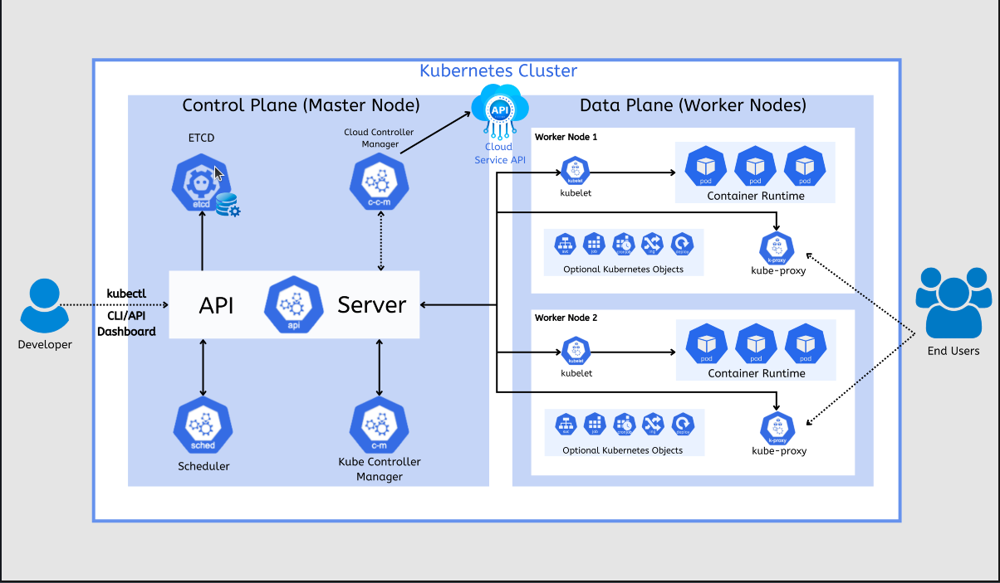

# Kubernets course
This is a readme for documentation of my studies on kubernets, that i am start today using the course on udemy


# What is Kubernets ?

KUbernets is an open-source system for container orchestration  it manages all life cycle of containers docker.





this the example for kubernets cluster

### Control plane

The control plane is very important for manage the custer, is the brain of the cluster inside it we have some very importants parts of kubernets like

- `ETCD`: The database no sql that kubernets use for save the worker's node state 

- `Scheduler`: Scheduler is who decide on wich a new node should run based on node health metrics

- `Controler Manager`: This men is who control the cluster based in waht you want, example if you want an container have 3 replicas the control manage will mantain 3 replicas of the container. Another important is an controller of the nodes, so he monitor if the nodes is sending health checks to him. 

- `HPA ( Horizontal pod scale )`: Monitor the pod CPU, Memory usage and if a node is not health then he do the horizontal scale, alocating mor resources for the node


PDB


## Minikube
  Responsible for up un cluster kubernets on our local machine inside docker container

For install minikube

```bash
curl -LO https://storage.googleapis.com/minikube/releases/latest/minikube-linux-amd64
sudo install minikube-linux-amd64 /usr/local/bin/minikube
minikube version
```

After install the minikube, just start it with

```bash
minikube start
```

You will see the display on your terminal

``` 
  Kubernets-Course git:(main) minikube start

😄  minikube v1.38.1 on Ubuntu 26.04
✨  Automatically selected the docker driver. Other choices: ssh, none
❗  Starting v1.39.0, minikube will default to "containerd" container runtime. See #21973 for more info.
📌  Using Docker driver with root privileges
👍  Starting "minikube" primary control-plane node in "minikube" cluster
🚜  Pulling base image v0.0.50 ...
💾  Downloading Kubernetes v1.35.1 preload ...
    > preloaded-images-k8s-v18-v1...:  272.45 MiB / 272.45 MiB  100.00% 28.97 M
    > gcr.io/k8s-minikube/kicbase...:  519.58 MiB / 519.58 MiB  100.00% 29.19 M
🔥  Creating docker container (CPUs=2, Memory=7800MB) ...
🐳  Preparing Kubernetes v1.35.1 on Docker 29.2.1 ...
🔗  Configuring bridge CNI (Container Networking Interface) ...
🔎  Verifying Kubernetes components...
    ▪ Using image gcr.io/k8s-minikube/storage-provisioner:v5
🌟  Enabled addons: storage-provisioner, default-storageclass
💡  kubectl not found. If you need it, try: 'minikube kubectl -- get pods -A'
🏄  Done! kubectl is now configured to use "minikube" cluster and "default" namespace by default

``` 
You can see the the minkube container up in your machine with

```bash
➜  ~ docker ps
CONTAINER ID   IMAGE                                 COMMAND                  CREATED         STATUS         PORTS                                                                                                                                  NAMES
2f80f64219c3   gcr.io/k8s-minikube/kicbase:v0.0.50   "/usr/local/bin/entr…"   3 minutes ago   Up 3 minutes   127.0.0.1:32773->22/tcp, 127.0.0.1:32774->2376/tcp, 127.0.0.1:32775->5000/tcp, 127.0.0.1:32776->8443/tcp, 127.0.0.1:32777->32443/tcp   minikube
➜  ~ 

```

if you want stop your cluster only run the comand

```bash 
minikube stop
```

or if you want delete the cluster

```bash
minikube delete
```

## Kubectl

Kubectl is the official cli from kubernets, with it we will interact with the kubernets cluster.

For install kubectl

```bash 
cd /tmp
KUBECTL_VERSION=$(curl -sL https://dl.k8s.io/release/stable.txt)

curl -LO "https://dl.k8s.io/release/${KUBECTL_VERSION}/bin/linux/amd64/kubectl"
curl -LO "https://dl.k8s.io/release/${KUBECTL_VERSION}/bin/linux/amd64/kubectl.sha256"

echo "$(cat kubectl.sha256)  kubectl" | sha256sum --check

sudo install -o root -g root -m 0755 kubectl /usr/local/bin/kubectl
kubectl version --client
``` 

After install we can use the comand for see all services runing on our cluster kubernets

```bash
ktop  Documents  Downloads  Music  Pictures  Public  Templates  Videos  snap
➜  ~ kubectl get po -A     
NAMESPACE     NAME                               READY   STATUS    RESTARTS      AGE
kube-system   coredns-7d764666f9-thj8t           1/1     Running   0             28m
kube-system   etcd-minikube                      1/1     Running   0             29m
kube-system   kube-apiserver-minikube            1/1     Running   0             28m
kube-system   kube-controller-manager-minikube   1/1     Running   0             28m
kube-system   kube-proxy-lfnhc                   1/1     Running   0             28m
kube-system   kube-scheduler-minikube            1/1     Running   0             28m
kube-system   storage-provisioner                1/1     Running   1 (28m ago)   28m
➜  ~ 

```


