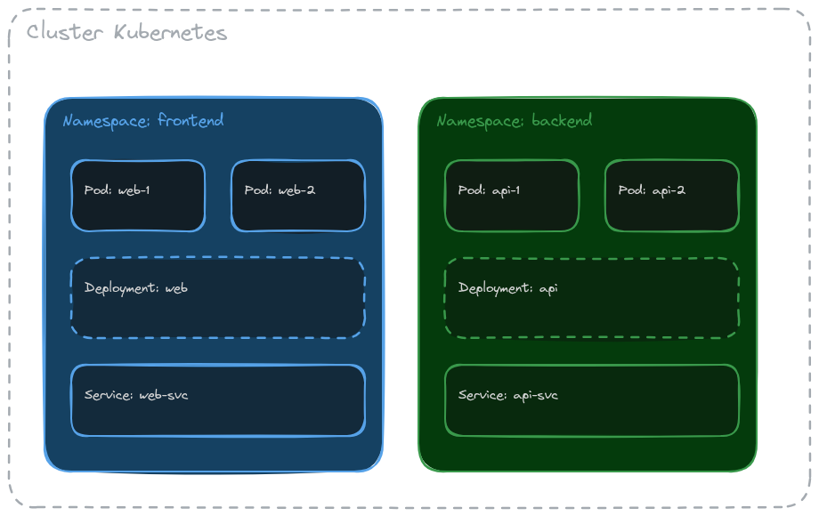
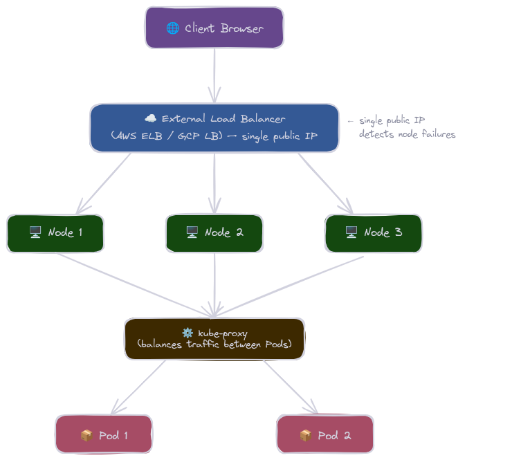

# Kubernets course
This is a readme for documentation of my studies on kubernets, that I started today using the Udemy course

# Table of Contents 

- [What is Kubernetes?](#what-is-kubernetes)
  - [Control Plane](#control-plane)
  - [Data Plane](#data-plane)
  - [Minikube](#minikube)
  - [Kubectl](#kubectl)
- [Workloads](#workloads)
  - [Pods](#going-up-the-first-pod)
  - [ReplicaSet](#replicaset)
  - [Deployments](#deployments)
  - [DaemonSet](#daemon-set)
  - [Jobs](#jobs)
  - [CronJobs](#cron-jobs)
  - [StatefulSet](#statefullset)
- [Networking](#kubernetes-networking)
  - [Intra Node Communication](#intra-node-pod-network-comunication)
  - [Inter Node Communication](#inter-node-network-comunication)
  - [Namespaces](#namespace)
  - [Services](#services)
  - [Ingress](#ingress)
- [Configuration & Storage](#config-map)
  - [ConfigMap](#config-map)
  - [Secrets](#secrets)
  - [Volumes](#volumes)
- [Reliability](#liveness-probe)
  - [Liveness Probe](#liveness-probe)
  - [Resources Management](#resources-management)
- [Security](#rbac-role-based-access-control)
  - [RBAC](#rbac-role-based-access-control)

# What is Kubernets ?

KUbernets is an open-source system for container orchestration  it manages all life cycle of containers docker.


this is an Kubernets cluster example:

### Control plane

The control plane is very important for manage the custer, is the brain of the cluster inside it we have some very importants parts of kubernets like:

- `ETCD`: The database no sql that kubernets use for save the entire cluster state

- `Scheduler`: Scheduler is who decide where a new pod should run based on the node helth metrics

- `Controler Manager`: This men is who control the cluster based in wath you want, example... if you want an container have 3 replicas, the control manage will mantain tre container's replica. Another important thing is an controller of the nodes, so he monitor if the nodes is sending health checks to him. 

## Data Plane

Imagine the diference between the control plan and Data plane is like the control is the brain and the data plane is the arms of the applications. Here we have the worker's node, can be physcal machine, or Virtual machines or containers like we are using now with the minukube. Inside the workers we have some componets importants like:

- `Pod`: Pod is the more litle part of the kubernets cluster, we have a pod, an inside the pod we can have some containers docker running inside it 
- `Kubelet`: The kubelet is who care about the containers is running helth or not, for example, if an container inside the pod down the kubelet restart the container, is a just simple example bu he has another responsibilites, talk with the cluster API server, sending helth metrics.
- `Kubeproxy`: The kubeproxy inside the node is the Network manager, DNS, IP, Proxy.....

One thing important, the kubelet dosen't run the container directaly inside the node, for it we have anothers tools calleb by `CRI (Container running interface)` so all kubernts cluster doesn't run the docker contarners diretaly, for it he use another tool for run docker containers like

- Container-d
- cri-o 

## Minikube
  Responsible for up un cluster kubernets on our local machine inside docker container

For install minikube

```bash
curl -LO https://storage.googleapis.com/minikube/releases/latest/minikube-linux-amd64
sudo install minikube-linux-amd64 /usr/local/bin/minikube
minikube version
```

After install the minikube, just start it with

```bash
minikube start
```

You will see the display on your terminal

```bash
  Kubernets-Course git:(main) minikube start

😄  minikube v1.38.1 on Ubuntu 26.04
✨  Automatically selected the docker driver. Other choices: ssh, none
❗  Starting v1.39.0, minikube will default to "containerd" container runtime. See #21973 for more info.
📌  Using Docker driver with root privileges
👍  Starting "minikube" primary control-plane node in "minikube" cluster
🚜  Pulling base image v0.0.50 ...
💾  Downloading Kubernetes v1.35.1 preload ...
    > preloaded-images-k8s-v18-v1...:  272.45 MiB / 272.45 MiB  100.00% 28.97 M
    > gcr.io/k8s-minikube/kicbase...:  519.58 MiB / 519.58 MiB  100.00% 29.19 M
🔥  Creating docker container (CPUs=2, Memory=7800MB) ...
🐳  Preparing Kubernetes v1.35.1 on Docker 29.2.1 ...
🔗  Configuring bridge CNI (Container Networking Interface) ...
🔎  Verifying Kubernetes components...
    ▪ Using image gcr.io/k8s-minikube/storage-provisioner:v5
🌟  Enabled addons: storage-provisioner, default-storageclass
💡  kubectl not found. If you need it, try: 'minikube kubectl -- get pods -A'
🏄  Done! kubectl is now configured to use "minikube" cluster and "default" namespace by default

``` 
You can see the the minkube container up in your machine with

```bash
➜  ~ docker ps
CONTAINER ID   IMAGE                                 COMMAND                  CREATED         STATUS         PORTS                                                                                                                                  NAMES
2f80f64219c3   gcr.io/k8s-minikube/kicbase:v0.0.50   "/usr/local/bin/entr…"   3 minutes ago   Up 3 minutes   127.0.0.1:32773->22/tcp, 127.0.0.1:32774->2376/tcp, 127.0.0.1:32775->5000/tcp, 127.0.0.1:32776->8443/tcp, 127.0.0.1:32777->32443/tcp   minikube
➜  ~ 

```

if you want stop your cluster only run the comand

```bash 
minikube stop
```

or if you want delete the cluster

```bash
minikube delete
```

## Kubectl

Kubectl is the official cli from kubernets, with it we will interact with the kubernets cluster.

For install kubectl

```bash 
cd /tmp
KUBECTL_VERSION=$(curl -sL https://dl.k8s.io/release/stable.txt)

curl -LO "https://dl.k8s.io/release/${KUBECTL_VERSION}/bin/linux/amd64/kubectl"
curl -LO "https://dl.k8s.io/release/${KUBECTL_VERSION}/bin/linux/amd64/kubectl.sha256"

echo "$(cat kubectl.sha256)  kubectl" | sha256sum --check

sudo install -o root -g root -m 0755 kubectl /usr/local/bin/kubectl
kubectl version --client
``` 

After install we can use the comand for see all services runing on our cluster kubernets

```bash
ktop  Documents  Downloads  Music  Pictures  Public  Templates  Videos  snap
➜  ~ kubectl get po -A     
NAMESPACE     NAME                               READY   STATUS    RESTARTS      AGE
kube-system   coredns-7d764666f9-thj8t           1/1     Running   0             28m
kube-system   etcd-minikube                      1/1     Running   0             29m
kube-system   kube-apiserver-minikube            1/1     Running   0             28m
kube-system   kube-controller-manager-minikube   1/1     Running   0             28m
kube-system   kube-proxy-lfnhc                   1/1     Running   0             28m
kube-system   kube-scheduler-minikube            1/1     Running   0             28m
kube-system   storage-provisioner                1/1     Running   1 (28m ago)   28m
➜  ~ 

```


### Going UP the first pod

In just a simple comand we can up for example a nginx server:

```bash
kubectl run my-pod-apache-server --image httpd
```
output: 

```
pod/my-pod-apache-server created

```

For you see the pod created:

```bash
kubectl get pods  
```
Output:

```bash
➜  Kubernets-Course git:(main) ✗ kubectl get pods   
NAME                   READY   STATUS    RESTARTS   AGE
my-pod-apache-server   1/1     Running   0          4m9s
➜  Kubernets-Course git:(main) ✗ 

```
For see more informations about the pod:

```bash
➜  Kubernets-Course git:(main) ✗ kubectl get pods -o wide
NAME                   READY   STATUS    RESTARTS   AGE     IP           NODE       NOMINATED NODE   READINESS GATES
my-pod-apache-server   1/1     Running   0          4m48s   10.244.0.6   minikube   <none>           <none>
➜  Kubernets-Course git:(main) ✗ 

```

For you see the pods in real time you can use 

```bash
kubectl get pods -w     

NAME                   READY   STATUS    RESTARTS   AGE
my-pod-apache-server   1/1     Running   0          5m47s


```


if you use the comand for see all pods runing in the cluster tha we see before like:

```bash
➜  Kubernets-Course git:(main) ✗ kubectl get pods -A
NAMESPACE              NAME                                         READY   STATUS    RESTARTS      AGE
default                my-pod-apache-server                         1/1     Running   0             7m23s
kube-system            coredns-7d764666f9-hthb5                     1/1     Running   0             26h
kube-system            etcd-minikube                                1/1     Running   0             26h
kube-system            kube-apiserver-minikube                      1/1     Running   0             26h
kube-system            kube-controller-manager-minikube             1/1     Running   0             26h
kube-system            kube-proxy-hwb92                             1/1     Running   0             26h
kube-system            kube-scheduler-minikube                      1/1     Running   0             26h
kube-system            storage-provisioner                          1/1     Running   1 (26h ago)   26h
kubernetes-dashboard   dashboard-metrics-scraper-5565989548-gnqvs   1/1     Running   0             26h
kubernetes-dashboard   kubernetes-dashboard-b84665fb8-rcnnp         1/1     Running   0             26h
➜  Kubernets-Course git:(main) ✗ 

```

You will see your container in the namespace `default`.

For delete the pod you can use:

``` bash
➜  Kubernets-Course git:(main) ✗ kubectl delete pods my-pod-apache-server
pod "my-pod-apache-server" deleted from default namespace
➜  Kubernets-Course git:(main) ✗ 

```

now if you get the pods, there isn't the pod in your default namespace

```bash
➜  Kubernets-Course git:(main) ✗ kubectl get pods                        
No resources found in default namespace.
➜  Kubernets-Course git:(main) ✗ 

```

This is an form for you create a simple pod with just an comand, but in the day by day in the companys usualy we use the yaml files, for set the configurations of the pods, is a simple yaml that usualy the peoples uses in docker compose files we also will use with the pods configurations and another things in kubernets.


For example, we hava the file my-pod.yml in this repository:

```yml
apiVersion: v1
kind: Pod
metadata:
   name: my-pod-webserver
   labels: 
     apps: my-app
     tier: frontend
spec:
   containers:
   - name: my-container-nginx
     image: nginx

```


We are going up an container with a simple nginx app, for up the fod from yml file you can use the comand:

```bash
kubectl create -f my-pod.yml

```

output: 

```bash
pod/my-pod-webserver created

```

Now you can see the pod simple pod already created:

```bash
➜  Kubernets-Course git:(main) ✗ kubectl get pods            
NAME               READY   STATUS    RESTARTS   AGE
my-pod-webserver   1/1     Running   0          2m53s

```


## ReplicaSet


The replica set is an resource from kubernets that we can replicate the pod in anothers pods, for example in our aplication tha we were going up the nginx, with the replica set we can replicate the nginx in another for pods:


```yaml
apiVersion: apps/v1
kind: ReplicaSet
metadata: 
   name: frontend-rs
   labels: 
     app: frontend

spec: 
  template:
    metadata: 
      name: my-pod-webserver
      labels: 
        apps: my-app
        tier: frontend
    spec:
      containers:
      - name: my-container-nginx
        image: nginx

  selector:
    matchLabels: 
     apps: my-app
  replicas: 4

```

for apply just run the command: 

```bash
 kubectl apply -f my-replica-set.yml  
```

For see the replica set created:

```zsh
 Kubernets-Course git:(main) ✗ kubectl get replicaset
NAME          DESIRED   CURRENT   READY   AGE
frontend-rs   4         4         4       2m

```

Now you can see the 4 pods created: 


```zsh
➜  Kubernets-Course git:(main) ✗ kgp                
NAME                READY   STATUS    RESTARTS   AGE
frontend-rs-f7qxp   1/1     Running   0          31m
frontend-rs-g9prw   1/1     Running   0          24m
frontend-rs-rln7d   1/1     Running   0          31m
frontend-rs-rpbfs   1/1     Running   0          31m
➜  Kubernets-Course git:(main) ✗ 

```

for example, if you delete the pod `frontend-rs-f7qxp` the control manager will maintain 4 replicas of you pods sets on your replicaset.

Example:
```zsh
➜  Kubernets-Course git:(main) ✗ kgp                  
NAME                READY   STATUS    RESTARTS   AGE
frontend-rs-f7qxp   1/1     Running   0          35m
frontend-rs-g9prw   1/1     Running   0          27m
frontend-rs-rln7d   1/1     Running   0          35m
frontend-rs-rpbfs   1/1     Running   0          35m
➜  Kubernets-Course git:(main) ✗ kubectl delete pods frontend-rs-f7qxp                 
pod "frontend-rs-f7qxp" deleted from default namespace
➜  Kubernets-Course git:(main) ✗ kgp                                  
NAME                READY   STATUS    RESTARTS   AGE
frontend-rs-g9prw   1/1     Running   0          28m
frontend-rs-mccc2   1/1     Running   0          7s
frontend-rs-rln7d   1/1     Running   0          35m
frontend-rs-rpbfs   1/1     Running   0          35m
```

i delete the pod manualy and automatcaly the control manager create the pod to me for replace because i hava an replicaSet setted tha i want 4 replica's created.
Now if you delete the replicaset, then the pods will be deleted automaticaly:

```zsh
➜  Kubernets-Course git:(main) ✗ kubectl get replicaset
NAME          DESIRED   CURRENT   READY   AGE
frontend-rs   4         4         4       40m
➜  Kubernets-Course git:(main) ✗ kubectl delete replicaset frontend-rs
replicaset.apps "frontend-rs" deleted from default namespace
➜  Kubernets-Course git:(main) ✗ kubectl get replicaset               
No resources found in default namespace.
➜  Kubernets-Course git:(main) ✗ kubectl get pods      
No resources found in default namespace.
➜  Kubernets-Course git:(main) ✗ 
```

## Deployments


This is a very important tool in the kubernets context, because whith deplroyments we can do a lot of things like:

- `Replica Managment`: In other words, we can do all what we see in the last chapter with `replica set`, we can keep for examples N pods runing at all time; if one dies it spins up a replacement

- `Roling Updates`: Whe we change the image or config, it gradually replaces in pods with less requests first and after in the pods with more requests

- `Rollbacks`: If a new version breaks in prod, we can do rollbacks for revert the last change

we can try create a deploy like this:

```yaml
apiVersion: apps/v1
kind: Deployment
metadata:
  name: frontend-deployment
  labels: 
    app: frontend

spec:
  template:
    metadata:
      name: pod-my-nginx
      labels:
        env: production
    spec:
      containers: 
        - name: nginx-container
          image: nginx:1.27
  selector:
    matchLabels:
      env: production
  replicas: 4
```

For apply just you run the comand:

 ```bash
 kubectl apply -f my-deployment.yml 
 ```

 See the deployment created:

```bash
➜  Kubernets-Course git:(main) ✗ kubectl get deployments     
NAME                  READY   UP-TO-DATE   AVAILABLE   AGE
frontend-deployment   4/4     4            4           3h31m

```

The deplyoment for mantain the replicas, he use the replica set resource for mantain the replicas so if you get the replicas set you will see

```bash
  Kubernets-Course git:(main) ✗ kubectl get replicaset                                    
NAME                             DESIRED   CURRENT   READY   AGE
frontend-deployment-6b976dbd67   4         4         4       160m
```

So if you get the pods we will see the 4 pods created:

```bash
-> Kubernets-Course git:(main) ✗ kubectl get pods        
NAME                                   READY   STATUS    RESTARTS   AGE
frontend-deployment-6b976dbd67-c2tcz   1/1     Running   0          161m
frontend-deployment-6b976dbd67-gspmw   1/1     Running   0          161m
frontend-deployment-6b976dbd67-j4f9t   1/1     Running   0          161m
frontend-deployment-6b976dbd67-m7hvl   1/1     Running   0          161m

```

One important thing for you see is the comand:

```bash
kubectl describe  deployment.apps/frontend-deployment

```

The output:

```bash
➜  Kubernets-Course git:(main) ✗ kubectl describe  deployment.apps/frontend-deployment
Name:                   frontend-deployment
Namespace:              default
CreationTimestamp:      Thu, 13 Aug 2026 10:42:25 -0300
Labels:                 app=frontend
Annotations:            deployment.kubernetes.io/revision: 2
Selector:               env=production
Replicas:               4 desired | 4 updated | 4 total | 4 available | 0 unavailable
StrategyType:           RollingUpdate
MinReadySeconds:        0
RollingUpdateStrategy:  25% max unavailable, 25% max surge
Pod Template:
  Labels:  env=production
  Containers:
   nginx-container:
    Image:         nginx:1.27
    Port:          <none>
    Host Port:     <none>
    Environment:   <none>
    Mounts:        <none>
  Volumes:         <none>
  Node-Selectors:  <none>
  Tolerations:     <none>
Conditions:
  Type           Status  Reason
  ----           ------  ------
  Available      True    MinimumReplicasAvailable
  Progressing    True    NewReplicaSetAvailable
OldReplicaSets:  frontend-deployment-5768454449 (0/0 replicas created)
NewReplicaSet:   frontend-deployment-6b976dbd67 (4/4 replicas created)
Events:          <none>

```
### Rooling Update strategy 
The flag `RollingUpdateStrategy` is a very impotant concept for you understand, for example like above we have: 

- `25% max unavailable`: If we have some update, we will have just 25% of out infrasctruture down
- `25% max surge`: We can create 25% of our infrasctuture for replace the old pods 

So for example, we have 4 replicas of our nginx, let's say i want to alter the nginx image for 1.28 what it happends ? 


The cluster will stop the one of the 4 pods that representing exactly 25% of our infrastructure an in the midle of that process will spin up another pod with the new vesion and when finished then it going to next;

### Rolout History

When we apply some change in the deployments, the cluster save the deployment's version in your database, so for example above we change the nginx's image from 1.27 -> 1.28 if you put the command on you terminal you can see the version

```bash
➜  Kubernets-Course git:(main) ✗ kubectl rollout history deployment frontend-deployment 
deployment.apps/frontend-deployment 
REVISION  CHANGE-CAUSE
1         <none>
2         <none>
3         <none>

```

So if you alter anything in the yml file, will be create a ne revision, and for you see with more detail you can set the exactly revision:

```bash
➜  Kubernets-Course git:(main) ✗ kubectl rollout history deployment frontend-deployment --revision=3
deployment.apps/frontend-deployment with revision #3
Pod Template:
  Labels:       env=production
        pod-template-hash=5b956c8bdc
  Containers:
   nginx-container:
    Image:      nginx:1.18.0
    Port:       <none>
    Host Port:  <none>
    Environment:        <none>
    Mounts:     <none>
  Volumes:      <none>
  Node-Selectors:       <none>
  Tolerations:  <none>

➜  Kubernets-Course git:(main) ✗ 
```

### Deployment rollback

If one change don't work's like you want, you can do the rolled back to another version:

```bash
kubectl rollout undo deployment frontend-deployment
```

Then your pod will return to the old version:

```bash
➜  Kubernets-Course git:(main) ✗ kubectl rollout history deployment frontend-deployment             
deployment.apps/frontend-deployment 
REVISION  CHANGE-CAUSE
1         <none>
3         <none>
4         <none>

➜  Kubernets-Course git:(main) ✗ 

```

For example above, we were in the version tree i rollback to the version 2, but for example you can rolled back to a specifique version:

```bash
kubectl rollout undo deployment frontend-deployment --to-revision=4 

```


# Kubernets Netowrking


## Intra Node pod Network comunication

When the kubelet created an new pod, he called the `CNI (Container Network Interface)` for create the virtual ethernet to the pod and alocate the IP address to pod, and after he connect the virtual ethernet in a node brigde network, for alls pod from the node can comunicate in the local network with not NAT.


How you can see in the image above, for pod to pod comunication they comunicate bt local host, so for example when an container needs to comunicate with another contairner they use  `localhost`:8080 the ports indicate what container will be comunicate.

But wha happend when you need to comunicate with another contaner inside in a pod in another worker ? 

## Inter node network comunication


Whe we need to comunicate with another pod in another node, behind the scenes the CNI trasport the trafic in aa protocol of cluster like vxlan ou anothers for comunicate in the same local network.


# Namespace



With the logical isolate we can projects like deployments, replica sets, pods. For example, you can isolate your front from backend, and another things that you can do, you literaly can separate per aplications.

```bash
➜  Kubernets-Course git:(main) kubectl get ns                      
NAME                   STATUS   AGE
default                Active   6d5h
kube-node-lease        Active   6d5h
kube-public            Active   6d5h
kube-system            Active   6d5h
kubernetes-dashboard   Active   6d5h
➜  Kubernets-Course git:(main) 


```

Usualy the kubernets already separate some things in namespace like `kube-system`

```bash
➜  Kubernets-Course git:(main) ✗ kubectl get pods -n kube-system
NAME                               READY   STATUS    RESTARTS       AGE
coredns-7d764666f9-hthb5           1/1     Running   2 (132m ago)   6d5h
etcd-minikube                      1/1     Running   2 (132m ago)   6d5h
kube-apiserver-minikube            1/1     Running   2 (132m ago)   6d5h
kube-controller-manager-minikube   1/1     Running   2 (132m ago)   6d5h
kube-proxy-hwb92                   1/1     Running   2 (132m ago)   6d5h
kube-scheduler-minikube            1/1     Running   2 (132m ago)   6d5h
storage-provisioner                1/1     Running   5 (131m ago)   6d5h
➜  Kubernets-Course git:(main) ✗ 


```

For example, with the comand above we can see the pods created in kube-system's namespaces that the minikube create when he is up. For create a new namespace you can do:

```bash
➜  Kubernets-Course git:(main) ✗ kubectl create ns frontend --save-config
namespace/frontend created

```

Now you can see the new namespace:

```bash
➜  Kubernets-Course git:(main) ✗ kubectl get ns                          
NAME                   STATUS   AGE
default                Active   6d5h
frontend               Active   62s
kube-node-lease        Active   6d5h
kube-public            Active   6d5h
kube-system            Active   6d5h
kubernetes-dashboard   Active   6d5h
```

For create a new pod in that namespace, tou can just:

```bash
➜  Kubernets-Course git:(main) ✗ kubectl apply -f tocat-pod.yml -n frontend 
pod/tomcat-pod created

```

With the tag `n` we can up the pod on frontend namespace

```bash
kubectl get pods -n frontend 

NAME         READY   STATUS    RESTARTS   AGE
tomcat-pod   1/1     Running   0          55s


```

When we introduces on kubernets per default we are in the default namespace, for we alter the default namespace to the `frontend` that what we already create.

```bash
➜  Kubernets-Course git:(main) ✗ kubectl config set-context --current --namespace=frontend
Context "minikube" modified.

```

Now we are on frontend namespace per default

```bash
➜  Kubernets-Course git:(main) ✗ kubectl config set-context --current --namespace=frontend
Context "minikube" modified.

```

Now you can see the pods with no namespace set on the comand without specfying the namespace in the comand

```bash
➜  Kubernets-Course git:(main) ✗ kubectl get pods
NAME         READY   STATUS    RESTARTS   AGE
tomcat-pod   1/1     Running   0          8m8s
```

you also can create the namespace with manifest files like this:

```bash

apiVersion: v1
kind: Namespace

metadata:
  name: backend-ns
  labels:
    apps: backend-apps

```

Now just you apply the file:

```bash
➜  Kubernets-Course git:(main) ✗ kubectl apply -f backend-namespace.yml 
namespace/backend-ns created

```

When you need to up a new pod, unless you set the namespace in the line command you can only set the namespace on pod metadata like this:

```bash
apiVersion: v1
kind: Pod
metadata:
  name: redis-pod
  namespace: backend-ns #### you put the namespace here
  labels:
    apps: backend
spec:
  containers:
    - name: redis-container
      image: redis

``` 

When you need to delete the namespace be careful because when you delete the namespace all things under the namespace is deleted so pods, replicasets, deployments is deleted


```bash
➜  Kubernets-Course git:(main) ✗ kubectl delete ns frontend 
namespace "frontend" deleted
```


# Services

In Kubernetes, a Service exposes Pod applications to other Pods or external clients.

For example, if a container in Pod A needs to communicate with a container in Pod B,
you could use the Pod's IP address directly — and it would work at first.
However, Pods don't have fixed IP addresses. If a Pod is restarted or rescheduled,
its IP changes, breaking the communication.

Services solve this by providing a stable endpoint (IP + DNS) that always routes
traffic to the correct Pods, regardless of restarts.

## Cluster IP 

With the service cluster ip we use for internal comunications beteween the pods in our cluster for example bellow:

```yml
apiVersion: v1
kind: Pod 
metadata:
  name:  web-pod
  labels:
    type: web-app

spec:
  containers:
    - name: web-server-apache
      image: httpd
      ports:
        - containerPort: 8080
    
    - name: web-server-tomcat
      image: tomcat
      ports:
        - containerPort: 80
---
apiVersion: v1
kind: Service
metadata: 
  name: frontend-service
spec:
  type: ClusterIP
  selector:
    type: web-app
  ports:
    - name: http
      port: 80
      targetPort: 8080


```


We created one pods and two containers with diferents ports for work and we created also the Service type CLuster IP using the selector looking for pods with labes `type: web-app` includes in our pod, when you apply the file you will be created the pods and service:


```bash
kubectl get services            

NAME               TYPE        CLUSTER-IP      EXTERNAL-IP   PORT(S)   AGE
frontend-service   ClusterIP   10.107.36.207   <none>        80/TCP    65m
kubernetes         ClusterIP   10.96.0.1       <none>        443/TCP   7d1h


```

With the port and target port flags in our Service


```yaml
apiVersion: v1
kind: Service
metadata: 
  name: frontend-service
spec:
  type: ClusterIP
  selector:
    type: web-app
  ports:
    - name: http
      port: 80
      targetPort: 8080
```

we are speeking to our cluster, if you get something in the service ip addres: 10.107.36.207:80 the services will search for pods with te labbel `type: web-app` and containers working in the `targetPort` 8080 and dirrecting the trafic to the pod ip addres / target port container. So for exaple, with our example above we have two containres in the pod, if we up a new pod like an debian for example:

```bash
ubectl run -it debian-pod --image=debian bash  
```

And run a curl comand in the ip services and port 80:

```bash
root@debian-pod:/# curl http://10.107.36.207
<!DOCTYPE HTML PUBLIC "-//W3C//DTD HTML 4.01//EN" "http://www.w3.org/TR/html4/strict.dtd">
<html>
<head>
<title>It works! Apache httpd</title>
</head>
<body>
<p>It works!</p>
</body>
</html>

```

We will be directing to the apache service.


## Node port

With the node port we can basicly expose a container inside a pod to the internet, is similary from cluster IP but we just apply a new config on yaml setting the node port

```yaml
apiVersion: v1
kind: Pod 
metadata:
  name:  web-pod
  labels:
    type: web-app

spec:
  containers:
    - name: web-server-apache
      image: httpd
      ports:
        - containerPort: 80
    
---
apiVersion: v1
kind: Service
metadata: 
  name: frontend-service
spec:
  type: NodePort
  selector:
    type: web-app
  ports:
    - name: http
      port: 80
      targetPort: 80
      nodePort: 30008
```


We just change the type from ClusterIP to NodePort and the flag `nodePort` is the external port open to the internet, just you apply the file and for you get the url just send the comand:

```
minikube service frontend-service --url
```

And will be displayed the url for you acess from your browser.

 
## LoadBalancer
 
The LoadBalancer Service type is used to expose your application to external traffic outside the cluster.
 
By default, Kubernetes does not have a single public entry point — each node has its own IP address. This means if you expose your app via NodePort, you have to pick one node's IP, and if that node goes down, external access breaks.
 
The LoadBalancer solves this by provisioning an external load balancer (like AWS ELB or GCP Load Balancer) that sits in front of your nodes with a single stable public IP:
 

 

 
To use it, just change the type in your manifest:
 
```yaml
apiVersion: v1
kind: Service
metadata:
  name: frontend-service
spec:
  type: LoadBalancer
  selector:
    type: web-app
  ports:
    - name: http
      port: 80
      targetPort: 80
```
 
On cloud providers, the `EXTERNAL-IP` is automatically provisioned. On Minikube, it stays `<pending>` because there is no cloud provider available — to test locally, run:
 
```bash
minikube tunnel
```
 
On bare metal or on-premise environments, you can use **MetalLB**, which acts as a load balancer running inside the cluster itself, without depending on a cloud provider.

# Ingress


We have a problem with Service type LoadBalancer: every time you create one in a cloud provider, a new external load balancer is provisioned automatically — and you pay for each one separately. The Ingress solves this by providing a single external entry point that routes traffic internally based on the request path. For example, teste.com.br/frontend routes to the frontend ClusterIP Service, and teste.com.br/api routes to the API ClusterIP Service — one load balancer paying, multiple services exposed.

Example: 

```yml
# Frontend Pod + Service
apiVersion: v1
kind: Pod
metadata:
  name: frontend-pod
  labels:
    app: frontend
spec:
  containers:
    - name: frontend
      image: httpd
      ports:
        - containerPort: 80
---
apiVersion: v1
kind: Service
metadata:
  name: frontend-svc
spec:
  type: ClusterIP
  selector:
    app: frontend
  ports:
    - port: 80
      targetPort: 80
---
# Backend Pod + Service
apiVersion: v1
kind: Pod
metadata:
  name: backend-pod
  labels:
    app: backend
spec:
  containers:
    - name: backend
      image: nginx
      ports:
        - containerPort: 80
---
apiVersion: v1
kind: Service
metadata:
  name: backend-svc
spec:
  type: ClusterIP
  selector:
    app: backend
  ports:
    - port: 80
      targetPort: 80
---
# Ingress
apiVersion: networking.k8s.io/v1
kind: Ingress
metadata:
  name: my-ingress
  annotations:
    nginx.ingress.kubernetes.io/rewrite-target: /
spec:
  ingressClassName: nginx
  rules:
    - host: lab.local
      http:
        paths:
          - path: /frontend
            pathType: Prefix
            backend:
              service:
                name: frontend-svc
                port:
                  number: 80
          - path: /api
            pathType: Prefix
            backend:
              service:
                name: backend-svc
                port:
                  number: 80
```


Just apply the file and we will up the pods more services and also the ingress. In ingress how you can see, we are routing the traffic between the services based on path.

The ingress created: 
```yml
➜  Kubernets-Course git:(main) ✗ kubectl get ingress
NAME         CLASS   HOSTS       ADDRESS        PORTS   AGE
my-ingress   nginx   lab.local   192.168.49.2   80      44s
➜  Kubernets-Course git:(main) ✗ 
```

One thing very important for we finshed the test is, how you can see above we have the ingress running on 162.168.49.2 in my local network but in our ingress we set:

```yml
rules:
    - host: lab.local
```

So the trafic will be routed just if the traf arrived in this domain, if arrived in the IP ingress the trafic doesn't bee routed. And for finish we need apply a comand in our local cluster for config this dns resloutions in ou local machine.

```bash
echo "192.168.49.2 lab.local" | sudo tee -a /etc/hosts
```

But you need change the IP tou your ingress IP *Dont use the same IP in my documention in your cluster*.  For we verify if is all ok, we can just apply a curl for see the trafic routed between the services.


```bash
curl http://lab.local/frontend
curl http://lab.local/api
```

The ouput:

```bash
➜  Kubernets-Course git:(main) ✗ curl http://lab.local/frontend

<!DOCTYPE HTML PUBLIC "-//W3C//DTD HTML 4.01//EN" "http://www.w3.org/TR/html4/strict.dtd">
<html>
<head>
<title>It works! Apache httpd</title>
</head>
<body>
<p>It works!</p>
</body>
</html>
➜  Kubernets-Course git:(main) ✗ 

```

```
➜  Kubernets-Course git:(main) ✗ curl http://lab.local/api     

<!DOCTYPE html>
<html>
<head>
<title>Welcome to nginx!</title>
<style>
html { color-scheme: light dark; }
body { width: 35em; margin: 0 auto;
font-family: Tahoma, Verdana, Arial, sans-serif; }
</style>
</head>
<body>
<h1>Welcome to nginx!</h1>
<p>If you see this page, nginx is successfully installed and working.
Further configuration is required for the web server, reverse proxy, 
API gateway, load balancer, content cache, or other features.</p>

<p>For online documentation and support please refer to
<a href="https://nginx.org/">nginx.org</a>.<br/>
To engage with the community please visit
<a href="https://community.nginx.org/">community.nginx.org</a>.<br/>
For enterprise grade support, professional services, additional 
security features and capabilities please refer to
<a href="https://f5.com/nginx">f5.com/nginx</a>.</p>

<p><em>Thank you for using nginx.</em></p>
</body>
</html>
➜  Kubernets-Course git:(main) ✗ 

```

# Liveness probe

In Kubernetes, a liveness probe is a container health checker. It consults
the container periodically to check if it is healthy. If the probe fails,
the kubelet restarts the container.

```bash
apiVersion: v1
kind: Pod
metadata:
  name: liveness-pod
spec:
  containers:
    - name: liveness-container-test
      image: busybox
      args:
      - /bin/sh
      - -c
      - touch /tmp/healthy; sleep 30; rm -f /tmp/healthy; sleep 600

      livenessProbe:
        exec:
          command:
          - cat
          - /tmp/healthy
        initialDelaySeconds: 5
        periodSeconds: 5
        failureThreshold: 3
```


With the example above, wen the container is up we will create the file in */tmp/healthy* and after 30 seconds we will delete this file wait   600 seconds. In the liveness probe we send the comand  */tmp/healthy* with initial delay 5 seconds and checking every 5 seconds. if the file does not exists, the comand fails, the probe fails, and the kubernetes restart the container.

# Resources management

We can set manualy the resources that the container will be used, like if i want the container run just with one cpu or 250mib memory we can:

```yaml
apiVersion: v1
kind: Pod
metadata:
  name: resources-pod
spec:
  containers:
  - name: apache-container
    image: httpd
    
    resources:
      requests: 
        cpu: "500m"
        memory: "128Mi"
      limits:
        cpu: "1000m"
        memory: "256Mi"
```

The flag

- `requests`: is the miniamal necessary to container run 
- `limits`: How the name say, is the limit that the cotainer can used

if you apply the pod, you can see the resources setted on container with

```bash
kubectl describe pods NamePod
```
the output

```bash
Ps:
  IP:  10.244.0.75
Containers:
  apache-container:
    Container ID:   docker://1f49b51aba448234c6a3932f77caa564b41003db4f98dc7339c762586cc5e2d8
    Image:          httpd
    Image ID:       docker-pullable://httpd@sha256:2920ed8587277d6aa8ea785e143e970835057123dc7bf1199d102c60c80a73bb
    Port:           <none>
    Host Port:      <none>
    State:          Running
      Started:      Wed, 19 Aug 2026 14:54:48 -0300
    Ready:          True
    Restart Count:  0
    Limits:
      cpu:     1
      memory:  256Mi
    Requests:
      cpu:        500m
      memory:     128Mi
    Environment:  <none>
    Mounts:
      /va
```

# Volumes

In kubernetes there are two kinds volumes that are very important to  understanding before we continue:

- `Ephemeral volumes`: Volumes that the life clycle is tied to the pod lifecycle, so if the pod dies the datas on volume is lost too
- `Persistence Volumes`: The volume lifecycle is decoupled from pod life-cycle, usualy we use when the data needs to outlive the pod 


## EmptyDir
This is an ephemeral volume called `emptyDir` this indicates that if the pod is deleted the data will be deleleted together but if the pod is restarted the data will not deleted. 


```yml

apiVersion: v1
kind: Pod
metadata:
  name: redis-pod

spec: 
  containers:
  - name: redis-container
    image: redis
    volumeMounts:
      - name: "cache-storage"
        mountPath: "/my-volume"

  volumes:
  -  name: cache-storage
     emptyDir: {}

```

Just apply and if you entry on pod you will see the path mount in `/my-volume` inside container.


## Host Path
The host path how name already tell us, it create an path inside on node, where if the pod is deleted the data mantain in the node host.

```yml
apiVersion: v1
kind: Pod
metadata:
  name: redis-pod

spec: 
  containers:
  - name: redis-container
    image: redis
    volumeMounts:
    - mountPath: "/my-volume"
      name: "persist-volume"
      

  volumes:
  -  name: "persist-volume"
     hostPath:
       path: "/var/lib/2-persist"
     
```

Like above, when the pod is createa automatcaly the kubernetes create a volume in `/var/lib/2-persist` on node, where you can mount the volumes from your containers. 

## Persistent Volume Clain

Usualy in day by day when you use cloud providers, the comapany's usualy mount the volumes in `EBS` like on AWS out from node, so the conatainer's data is almost never losted, your cluster kubernetes can down and your datas is save on volumes. And for it, we have the Persistent Volume clain but after this whe have configuration some things like:

### Storage Class
The storage class we set the configuration in where we will create the volumes:

```yml
apiVersion: storage.k8s.io/v1
kind: StorageClass
metadata:
  name: ebs-sc
provisioner: ebs.csi.aws.com
volumeBindingMode: WaitForFirstConsumer  # Wait the pod stay up for create
parameters:
  type: gp3
```

### Persistent Volume Clain (PVC)

The persistent volume we set how the POD will consume the storage volume
```yml
apiVersion: v1
kind: PersistentVolumeClaim
metadata:
  name: redis-pvc
spec:
  accessModes:
  - ReadWriteOnce       r vez)
  storageClassName: ebs-sc
  resources:
    requests:
      storage: 5Gi
```

The `accessModes` flag define ther access on storage and we have some options under:

- `ReadWriteOnce`: Only one node can write and read the volume
- `ReadOnlyMany`: All nodes can read
- `ReadWriteMany`: all nodes can read and write on volume


### Pod using PVC

```yml
apiVersion: v1
kind: Pod
metadata:
  name: redis-pod
spec:
  containers:
  - name: redis-container
    image: redis
    volumeMounts:
    - name: redis-storage
      mountPath: "/data"
  volumes:
  - name: redis-storage
    persistentVolumeClaim:
      claimName: redis-pvc   # indicates the pvc above
```

When the pod is created, automaticaly is create a new volume on cloud provider and providers like AWS already connets the volume on node.


# Daemon Set

In kubernetes we can create daemons, is like replica sets however we can replicate our pods in another nodes, the yaml is similary to replica set. before we try it, we needs to create another node, for it just: 

```bash
minikube add node
```

and for you see the node running 

```bash
➜  Kubernets-Course git:(main) ✗ kubectl get nodes       
NAME           STATUS   ROLES           AGE   VERSION
minikube       Ready    control-plane   9d    v1.35.1
minikube-m02   Ready    <none>          50m   v1.35.1
minikube-m03   Ready    <none>          44m   v1.35.1
➜  Kubernets-Course git:(main) ✗
```


Now we can create the daemon set


```yml
apiVersion: apps/v1
kind: DaemonSet
metadata: 
   name: frontend-daemonset
   labels: 
     app: frontend

spec: 
  template:
    metadata: 
      name: my-pod-webserver
      labels: 
        apps: my-app
        tier: frontend
    spec:
      containers:
      - name: my-container-nginx
        image: nginx

  selector:
    matchLabels: 
     apps: my-app

```

Just apply the file and see the pods created in all nodes:

```bash
➜  Kubernets-Course git:(main) ✗ kubectl get pods -o wide                                   
NAME                       READY   STATUS    RESTARTS      AGE     IP            NODE           NOMINATED NODE   READINESS GATES
frontend-daemonset-5xjrz   1/1     Running   0             9m15s   10.244.0.2    minikube-m02   <none>           <none>
frontend-daemonset-98hng   1/1     Running   0             9m15s   10.244.0.83   minikube       <none>           <none>
frontend-daemonset-xxpng   1/1     Running   0             9m15s   10.244.0.2    minikube-m03   <none>           <none>

```

if you up a new node, the daemon will create a new inside node


## Daemon Node Selector

We can set the node inside yml config tha what we want to use by labels, first foy you see which labels you have in your nodes

```bash
kubectl get nodes --show-labels
```

For apply a new label on node

```bash
kubectl label node minikube-m02  diskType=ssd
```

now in you yaml file add the node selector


```yml
apiVersion: apps/v1
kind: DaemonSet
metadata: 
   name: frontend-daemonset
   labels: 
     app: frontend

spec: 
  template:
    metadata: 
      name: my-pod-webserver
      labels: 
        apps: my-app
        tier: frontend
    spec:
      containers:
      - name: my-container-nginx
        image: nginx

      nodeSelector:
        diskType: ssd

  selector:
    matchLabels: 
     apps: my-app

```


After apply just see that now it up just in one node now 
```bash
➜  Kubernets-Course git:(main) ✗ kubectl get pods -o wide      
NAME                       READY   STATUS    RESTARTS   AGE   IP           NODE           NOMINATED NODE   READINESS GATES
frontend-daemonset-rqbvj   1/1     Running   0          13s   10.244.0.4   minikube-m02   <none>           <none>

```

Or if you dont want to use by labels, you can just set the node Name

```yml
apiVersion: apps/v1
kind: DaemonSet
metadata: 
   name: frontend-daemonset
   labels: 
     app: frontend

spec: 
  template:
    metadata: 
      name: my-pod-webserver
      labels: 
        apps: my-app
        tier: frontend
    spec:
      nodeName: minikube-m02 
      containers:
      - name: my-container-nginx
        image: nginx

      nodeSelector:
        diskType: ssd

```

## Update Strategy

By default, the DaemonSets use the rolling update strategy, the same concept
we saw in [Deployments Rolling Update Strategy](#rooling-update-strategy).

When you update the DaemonSet (change the image, for example), Kubernetes will
update the pods one by one across the nodes, ensuring the workload stays available
during the update.

We have two strategies available:

- `RollingUpdate` (default): Updates pods one by one across nodes automatically
- `OnDelete`: The pod is only updated when you **manually delete it** — Kubernetes
  will not touch the running pod until you delete it yourself

```yaml
apiVersion: apps/v1
kind: DaemonSet
metadata:
  name: frontend-daemonset
spec:
  updateStrategy:
    type: RollingUpdate       
    rollingUpdate:
      maxUnavailable: 1       
  template:
    ...
```

### When to use OnDelete?

Use `OnDelete` when you want full control of when each node gets updated —
for example, in critical infrastructure where you want to manually validate
each node before proceeding to the next one. It's the more conservative approach.


# Jobs

In kubernetes the pods, unlike from daemon sets and deployments which create pods and keep them alive no matters what. Jobs works differently. With pods we can create pods designed for run a task, and once finished, the pod is terminated.

A simple example:

- `Job`: The manager who ensures the task has been completed
- `Pod`: The employee who executes the task
- `Container`: The tool the  employee  uses to do the task


## Creating a JOb

```yml
apiVersion: batch/v1
kind: Job
metadata:
  name: luck-number-generator
  labels:
    app: lucknumbers
spec:
  completions: 1  ## How many executions sucessful
  parallelism: 2  ## How many run in parallel
  backoffLimit: 3 ## attempts before  mark fail
  ttlSecondsAfterFinished: 60 ## Clear job after done
  template:
    spec: 
      restartPolicy: Never ## Never or OnFailure - Never Allways here
      containers:
        - name: lucknumbers
          image: python:3.11-alpine
          command: ["python", "-c"]
          args:
            - |
              import random
              numeros = sorted(random.sample(range(1, 61), 6))
              print("=== Números da Sorte da Loteria ===")
              for n in numeros:
                  print(f"  -> {n}")
              print("===================================")
              print("Job concluído com sucesso!")


```

After you apply the file, run a get pod in your terminal for see the job life cycle 

```
➜  Kubernets-Course git:(main) ✗ kubectl apply -f my-job.yml
job.batch/luck-number-generator created
➜  Kubernets-Course git:(main) ✗ kubectl get jobs           
NAME                    STATUS    COMPLETIONS   DURATION   AGE
luck-number-generator   Running   0/1           4s         4s
➜  Kubernets-Course git:(main) ✗ kubectl get jobs
NAME                    STATUS     COMPLETIONS   DURATION   AGE
luck-number-generator   Complete   1/1           7s         8s
➜  Kubernets-Course git:(main) ✗ kubectl logs jobs/luck-number-generator      
=== Números da Sorte da Loteria ===
  -> 11
  -> 16
  -> 28
  -> 39
  -> 41
  -> 53
===================================
Job concluído com sucesso!
➜  Kubernets-Course git:(main) ✗ kubectl get pods                       
NAME                          READY   STATUS      RESTARTS   AGE
frontend-daemonset-rqbvj      1/1     Running     0          23h
luck-number-generator-dm222   0/1     Completed   0          48s
➜  Kubernets-Course git:(main) ✗ 

```


As you can see on yml file the kubernets suport multiple tasks with parelelism in our terminal for example, lets say that we want 6 luck numbers we hav two ways do do it:

- `Sequential (Parallelism: 1)`: 

  ```
  Nuber 1 -> Number 2 - > Number 3 -> Number 4 -> Number 5 -> Number 6
  ```

- `Parallel (Parallelism: 2 )`

We will run two numbers together

```
  Nuber 1 -> Number 3 - > Number 5
  Nuber 2 -> Number 4 - > Number 6

```

to do this, just alter on yml file

```yml
apiVersion: batch/v1
kind: Job
metadata:
  name: luck-number-multi
  labels:
    app: lucknumbers
spec:
  completions: 6    ## Need 6 successful executions
  parallelism: 2    ## Run 2 pods at a time
  backoffLimit: 3
  ttlSecondsAfterFinished: 60
  template:
    spec:
      restartPolicy: Never
      containers:
        - name: lucknumbers
          image: python:3.11-alpine
          command: ["python", "-c"]
          args:
            - |
              import random
              import os
              numeros = sorted(random.sample(range(1, 61), 6))
              print(f"=== Números da Sorte ===")
              for n in numeros:
                  print(f"  -> {n}")
              print("=======================")
```

I recomend you apply and in another terminal you use the comand for see the pods being created

use this comand
```
watch kubectl get pods
```
you will se somethin like this

```
➜  Kubernets-Course git:(main) ✗ kubectl get pods           
NAME                          READY   STATUS      RESTARTS   AGE
frontend-daemonset-rqbvj      1/1     Running     0          24h
luck-number-generator-bhfs6   0/1     Completed   0          14s
luck-number-generator-cdqj9   0/1     Completed   0          10s
luck-number-generator-gj4tx   0/1     Completed   0          18s
luck-number-generator-mz75g   0/1     Completed   0          14s
luck-number-generator-qdwfm   0/1     Completed   0          10s
luck-number-generator-z6d26   0/1     Completed   0          18s
➜  Kubernets-Course git:(main) ✗ 
```

# Cron Jobs

If the job is a task with beginning, middle and end the cron is your scheduler who create the jobs automatcally in a defined hour 

The cron sintax

```
# ┌─────────── minute (0-59)
# │ ┌───────── hour (0-23)
# │ │ ┌─────── day of month (1-31)
# │ │ │ ┌───── month (1-12)
# │ │ │ │ ┌─── week day (0-6, 0=sunday)
# │ │ │ │ │
  * * * * *
```

Example:

```
"* * * * *"      # Every minute
"0 * * * *"      # Every hour (minute 0)
"0 8 * * *"      # Every day at 08:00
"0 8 * * 1"      # Every monday at 08:00
"0 0 1 * *"      # Every day 1 of month at midnight
"*/5 * * * *"    # Every five minutes
```

Example yml file

```yml
apiVersion: batch/v1
kind: CronJob
metadata:
  name: luck-number-cronjob
  labels:
    app: lucknumbers
spec:
  schedule: "* * * * *"        ## Every minute (for testing)
  successfulJobsHistoryLimit: 3 ## Keep last 3 successful jobs
  failedJobsHistoryLimit: 1     ## Keep last 1 failed job
  suspend: false                ## If true, pauses the CronJob
  jobTemplate:                  ## From here is a normal Job spec
    spec:
      template:
        spec:
          restartPolicy: Never
          containers:
            - name: lucknumbers
              image: python:3.11-alpine
              command: ["python", "-c"]
              args:
                - |
                  import random
                  numeros = sorted(random.sample(range(1, 61), 6))
                  print("=== Números da Sorte ===")
                  for n in numeros:
                      print(f"  -> {n}")
                  print("=======================")
```

after apply just see the jobs being created every minute: 

```
➜  Kubernets-Course git:(main) ✗ kubectl get jobs -w

NAME                           STATUS     COMPLETIONS   DURATION   AGE
luck-number-cronjob-29789004   Complete   1/1           8s         13s
luck-number-cronjob-29789005   Running    0/1                      0s
luck-number-cronjob-29789005   Running    0/1           0s         0s
luck-number-cronjob-29789005   SuccessCriteriaMet   0/1           4s         4s
luck-number-cronjob-29789005   Complete             1/1           4s         4s
luck-number-cronjob-29789006   Running              0/1                      0s
luck-number-cronjob-29789006   Running              0/1           0s         0s
luck-number-cronjob-29789006   SuccessCriteriaMet   0/1           3s         3s
luck-number-cronjob-29789006   Complete             1/1           3s         3s
luck-number-cronjob-29789007   Running              0/1                      0s
luck-number-cronjob-29789007   Running              0/1           0s         0s
luck-number-cronjob-29789007   SuccessCriteriaMet   0/1           3s         3s
luck-number-cronjob-29789007   Complete             1/1           3s         3s
luck-number-cronjob-29789004   Complete             1/1           8s         3m3s
```


# Config Map

This the kubertes way for manage variable envroiments, unless you implements the variable hardcode on image container, you can inject inside the container as env with config map. But one thing very important, in kubernetes the config map is recomend for use configMap just for configurations variables, your secret shold never be there for secrets we have another concept that we will explain in the next chapter. 

Config Map sintax

```yml
apiVersion: v1
kind: ConfigMap
metadata:
  name: postgres-config
data:
  POSTGRES_DB: "meubanco"
  POSTGRES_USER: "admin"
  POSTGRES_HOST: "localhost"
  MAX_CONNECTIONS: "100"
  TIMEZONE: "America/Sao_Paulo"
```

To use the congig map we will create the deployment with a postgress

```yml
# postgres-deployment.yaml
apiVersion: apps/v1
kind: Deployment
metadata:
  name: postgres
spec:
  replicas: 1
  selector:
    matchLabels:
      app: postgres
  template:
    metadata:
      labels:
        app: postgres
    spec:
      containers:
        - name: postgres
          image: postgres:16-alpine
          envFrom:
            - configMapRef:
                name: postgres-config  ## Injeta tudo como env var
```


for facility to you, you can apply in the same file

```yml
apiVersion: v1
kind: ConfigMap
metadata:
  name: postgres-config
data:
  POSTGRES_DB: "meubanco"
  POSTGRES_USER: "admin"
  POSTGRES_HOST: "localhost"
  MAX_CONNECTIONS: "100"
  TIMEZONE: "America/Sao_Paulo"

--- 

apiVersion: apps/v1
kind: Deployment
metadata:
  name: postgres
spec:
  replicas: 1
  selector:
    matchLabels:
      app: postgres
  
  template:
    metadata:
      labels:
        app: postgres
    spec:
      containers:
      - name: postgres
        image: postgres:16-alpine
        envFrom:
          - configMapRef:
              name: postgres-config ## inject var as env on pod

```

So if you apply, you will see that our config map and deploymeny is created: 

```bash
➜  Kubernets-Course git:(main) ✗ kubectl get deployments.apps 
NAME       READY   UP-TO-DATE   AVAILABLE   AGE
postgres   0/1     1            0           4m11s
➜  Kubernets-Course git:(main) ✗ 

```

The config map

```bash
➜  Kubernets-Course git:(main) ✗ kubectl get configmaps
NAME               DATA   AGE
kube-root-ca.crt   1      10d
postgres-config    5      17m
➜  Kubernets-Course git:(main) ✗ 
```

But the pod is not running because the postgress for initiality will needs the password database conf, if you see the logs will see this error:

```
➜  Kubernets-Course git:(main) ✗ kubectl get pods      
NAME                        READY   STATUS    RESTARTS        AGE
frontend-daemonset-6lprc    1/1     Running   0               20m
postgres-6f56db965b-xgwzv   0/1     Error     6 (2m43s ago)   6m3s
➜  Kubernets-Course git:(main) ✗ 
```

```bash
➜  Kubernets-Course git:(main) ✗ kubectl logs pods/postgres-6f56db965b-xgwzv 
Error: Database is uninitialized and superuser password is not specified.
       You must specify POSTGRES_PASSWORD to a non-empty value for the
       superuser. For example, "-e POSTGRES_PASSWORD=password" on "docker run".

       You may also use "POSTGRES_HOST_AUTH_METHOD=trust" to allow all
       connections without a password. This is *not* recommended.

       See PostgreSQL documentation about "trust":
       https://www.postgresql.org/docs/current/auth-trust.html
➜  Kubernets-Course git:(main) 
```

Now we will create the Secret service for up this database

# Secrets

The secrets is used for save the applications secrets, we don't use the config map in this case because the config map the info on cluster is up on plan text. When the kubernets insert the secret on pod it use Base64 for encode the secret. for create we can  just edit the yml file we were using for up the database

```yml

apiVersion: v1
kind: ConfigMap
metadata:
  name: postgres-config
data:
  POSTGRES_DB: "meubanco"
  POSTGRES_USER: "admin"
  POSTGRES_HOST: "localhost"
  MAX_CONNECTIONS: "100"
  TIMEZONE: "America/Sao_Paulo"
---
apiVersion: v1
kind: Secret
metadata:
  name: postgres-secret
type: Opaque
data:
  POSTGRES_PASSWORD: bWluaGFzZW5oYTEyMw== ## needs to bee base 64


--- 

apiVersion: apps/v1
kind: Deployment
metadata:
  name: postgres
spec:
  replicas: 1
  selector:
    matchLabels:
      app: postgres
  
  template:
    metadata:
      labels:
        app: postgres
    spec:
      containers:
      - name: postgres
        image: postgres:16-alpine
        envFrom:
          - configMapRef:
              name: postgres-config ## inject var as env on pod
          - secretRef:
              name: postgres-secret

```

Now we have, the config map for explain the postgress variables config and the secret ref using for encode the secret on cluster, but usualy in day bt dat we user another services for save the secret unless the cluster, like AWS Secret Key. 

# StatefullSet

The stateFullSet is a concept very important for us understanding, because with it we solve some problemas that we have in deployments. But after i need to explain a brief summary about what is aplications `Statefull` and `stateless`.

## `StateFull`
Statefull are aplications that need to save the information state, can bee like a Database server or Redis, or another aplications that needs to save information iside it. For example, you cannot delete one database and up another without the backup server.

## `Stateless`

State less aplications is the contrary statefull aplications, stateless aplications is aplications that doesn't needs to save the information inside then. Are aplications that if you down, you can up another in the same moment. Like an API that just needs to receive an http request, consult the information on database and return to user a json, if you delete the api you can up another in the same time. You dont needs to persist volumes for this application.

In this concept about `StateFull`and `Stateless`we have this example:

- Deployments -> `Stateless aplications`
- StateFullSet -> `StateFull aplications`

The statefullSet solve problems like:

- `Fixed name pod `:
The pod from stateFull diferent from deployment, never change. The name off your aplications is previsible;


- `Persistent Volume`
Each pod on stateFull has the persistent volume, so if you delete the pod, you had the data external from kubernetes.

- `DNS`
You don't need to create a new cluester ip service for expose your POD, when you create a new statefull pod, you need to create togheter a headless service, witch allows each pod to get its own DNS directly 

- `Inialize Order`

You can specify witch pods will inicializate first, for example if you had an clusterized database you can initializate one write database first.

For this up our first statefullSet we will use this example:

```
Namespace: statefulset-lab
    │
    ├── Headless Service (mysql)
    │
    └── StatefulSet (mysql)
            ├── mysql-0  → PVC: data-mysql-0
            ├── mysql-1  → PVC: data-mysql-1
            └── mysql-2  → PVC: data-mysql-2
```

For create the namespace

```
kubectl create namespace statefulset-lab
```

Now we will create the headless service:

```yml
apiVersion: v1
kind: Service
metadata:
  name: mysql
  namespace: statefulset-lab
spec:
  clusterIP: None        # <- this is the headless service
  selector:
    app: mysql
  ports:
    - port: 3306
      targetPort: 3306
```

Just apply and see the service created. 

As we learned for config we will use the config map and for secrets uses ther kubernetes secrests service:

```yml
apiVersion: v1
kind: ConfigMap
metadata:
  name: mysql-config
  namespace: statefulset-lab
data:
  MYSQL_DATABASE: "labdb"

---
apiVersion: v1
kind: Secret
metadata:
  name: mysql-secret
  namespace: statefulset-lab
type: Opaque
stringData:
  MYSQL_ROOT_PASSWORD: "minhasenha123"
```


and now the final, the statefullSet file:

```yml
apiVersion: apps/v1
kind: StatefulSet
metadata:
  name: mysql
  namespace: statefulset-lab
spec:
  serviceName: "mysql"
  replicas: 3
  selector:
    matchLabels:
      app: mysql
  template:
    metadata:
      labels:
        app: mysql
    spec:
      containers:
        - name: mysql
          image: mysql:8.0
          ports:
            - containerPort: 3306
          env:
            - name: MYSQL_ROOT_PASSWORD
              valueFrom:
                secretKeyRef:
                  name: mysql-secret
                  key: MYSQL_ROOT_PASSWORD
            - name: MYSQL_DATABASE
              valueFrom:
                configMapKeyRef:
                  name: mysql-config
                  key: MYSQL_DATABASE
          volumeMounts:
            - name: data
              mountPath: /var/lib/mysql
  volumeClaimTemplates:
    - metadata:
        name: data
      spec:
        accessModes: ["ReadWriteOnce"]
        resources:
          requests:
            storage: 1Gi
```

When you apply you can valid somethings:

- Pods
The pods will has a sequence: 

```
  Kubernets-Course git:(main) ✗ kubectl get pods -n statefulset-lab
NAME      READY   STATUS    RESTARTS   AGE
mysql-0   1/1     Running   0          12m
mysql-1   1/1     Running   0          12m
mysql-2   1/1     Running   0          12m

```

- ConfigMap

```
➜  Kubernets-Course git:(main) ✗ kubectl get configmap -n statefulset-lab
NAME               DATA   AGE
kube-root-ca.crt   1      23m
mysql-config       1      12m
➜  Kubernets-Course git:(main) ✗ 
```

- Secret

```
➜  Kubernets-Course git:(main) ✗ kubectl get secret -n statefulset-lab
NAME           TYPE     DATA   AGE
mysql-secret   Opaque   1      12m

```

- Headless service

```
➜  Kubernets-Course git:(main) ✗ kubectl get service  -n statefulset-lab
NAME    TYPE        CLUSTER-IP   EXTERNAL-IP   PORT(S)    AGE
mysql   ClusterIP   None         <none>        3306/TCP   20m
➜  Kubernets-Course git:(main) ✗ 

```

With this enviroment created, we can check the dns server running a new pod but manualy just for we try the resolution name:

```bash
kubectl run dns-test \
  --image=nicolaka/netshoot \
  --restart=Never \
  --namespace=statefulset-lab \
  -it --rm \
  -- bash
```

After just you send the `nslookup`comand for you see the resolution name

```bash
nslookup mysql-0.mysql.statefulset-lab.svc.cluster.local
nslookup mysql-1.mysql.statefulset-lab.svc.cluster.local
nslookup mysql-2.mysql.statefulset-lab.svc.cluster.local
```
Output 

```bash
dns-test:~# nslookup mysql-0.mysql.statefulset-lab.svc.cluster.local
;; Got recursion not available from 10.96.0.10
Server:         10.96.0.10
Address:        10.96.0.10#53

Name:   mysql-0.mysql.statefulset-lab.svc.cluster.local
Address: 10.244.0.3
;; Got recursion not available from 10.96.0.10

dns-test:~# nslookup mysql-1.mysql.statefulset-lab.svc.cluster.local
;; Got recursion not available from 10.96.0.10
Server:         10.96.0.10
Address:        10.96.0.10#53

Name:   mysql-1.mysql.statefulset-lab.svc.cluster.local
Address: 10.244.0.4
;; Got recursion not available from 10.96.0.10

dns-test:~# nslookup mysql-2.mysql.statefulset-lab.svc.cluster.local
;; Got recursion not available from 10.96.0.10
Server:         10.96.0.10
Address:        10.96.0.10#53

Name:   mysql-2.mysql.statefulset-lab.svc.cluster.local
Address: 10.244.0.5

```

The name server is generate like:

```
mysql-0  .  mysql  .  statefulset-lab  .  svc  .  cluster.local
   │           │              │              │           │
   │           │              │              │           └── domínio raiz do cluster
   │           │              │              └── service
   │           │              └── namespace
   │           └── name headless service
   └── name pod
```

Per deafault the rolling update strategy is like deployment but always the maximunUnvaiable is 1 pod, and the order to update the statefull set is from largest to smallest

```
mysql-2 → update → wait Ready ✅
mysql-1 → update → wait Ready ✅
mysql-0 → update → wait Ready ✅
```


# RBAC (Role Based Access Control)

In big's team, you want every person on your team had access only in what he needs. The `RBAC`is the config file that defines the user permissions, for especify exatly tha what ther person needs. With the RBAC we can answer this questions: 


1. Who needs access ? ->  User / Service account
2. What needs to do ? -> Verbs (get, list, delete)
3. Which resources ? -> Pods, secrets, configmap, deployments....
4. Which scope ? -> Namespace, all cluster 

Who receives the permissions ? 

- Users
  - Autenticated user
- User groups
- Service Accounts 


For explain this step i will create an RBAC for an auditor user that needs just needs access for reading on pods and deployments. 


For create the role:

```yml
apiVersion: rbac.authorization.k8s.io/v1
kind: Role
metadata:
  name: auditor-role
  namespace: rbac-lab
rules:
  - apiGroups: [""]
    resources: ["pods", "deployments"]
    verbs: ["get", "list", "watch"]

---

apiVersion: v1
kind: ServiceAccount
metadata:
  name: auditor
  namespace: rbac-lab

---

apiVersion: rbac.authorization.k8s.io/v1
kind: RoleBinding
metadata:
  name: auditor-binding
  namespace: rbac-lab
subjects:
  - kind: ServiceAccount
    name: auditor
    namespace: rbac-lab
roleRef:
  kind: Role
  name: auditor-role
  apiGroup: rbac.authorization.k8s.io
``` 

- Role: Defines what can do it
- Service Account: Defines who ca do it
- RoleBiding: Connects the two


This ServiceAccount has permission only to get, list and watch Pods and Deployments within the rbac-lab namespace."

```bash
# What the auditor can do it
kubectl auth can-i list pods \
  --as=system:serviceaccount:rbac-lab:auditor \
  -n rbac-lab

kubectl auth can-i get pods \
  --as=system:serviceaccount:rbac-lab:auditor \
  -n rbac-lab

# What the auditor cannot do it
kubectl auth can-i delete pods \
  --as=system:serviceaccount:rbac-lab:auditor \
  -n rbac-lab

kubectl auth can-i create deployments \
  --as=system:serviceaccount:rbac-lab:auditor \
  -n rbac-lab
```

And now  you can test the permission .